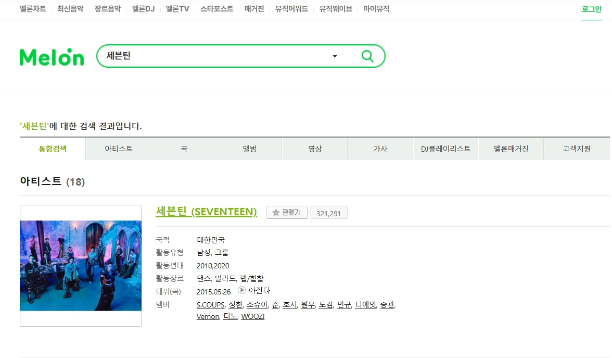
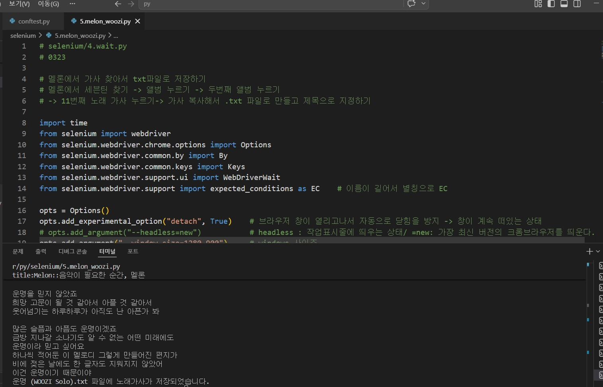
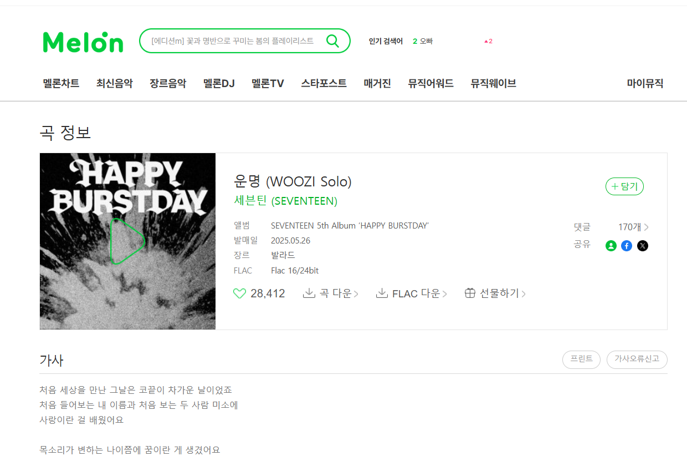

# Selenium활용 멜론에서 가사 가져오기

### 🔹 개요

- **서비스:** Melon 웹사이트
- **목적:** 특정 아티스트의 앨범 및 곡 정보를 탐색하여 가사를 자동으로 수집
- **사용 기술:** Python, Selenium

---

### 🔹 자동화 목표

사용자가 반복적으로 수행해야 하는
검색 → 앨범 이동 → 곡 선택 → 가사 복사 → 파일 저장
과정을 자동화하여 **작업 효율성을 향상시키는 것**을 목표했다.

---

### 🔹 자동화 시나리오 설계

다음과 같은 사용자 흐름을 기준으로 자동화를 설계했다.

1. 멜론 접속
2. "세븐틴" 검색
3. 앨범 탭 이동
4. 두 번째 앨범 선택
5. 특정 곡(11번째) 선택
6. 가사 추출
7. txt 파일로 저장

👉 실제 사용자 행동을 그대로 재현하는 방식으로 구성했다.

---

### 🔹 자동화 수행 과정

#### 🔎 검색 및 페이지 이동





👉 Selenium의 명시적 대기(`WebDriverWait`)를 활용하여 요소가 로드될 때까지 기다린 후 안정적으로 동작하도록 구현했다.

---

#### 🎤 앨범 및 곡 선택

```python
    # 두번째 앨범으로 이동
    wait.until(
        EC.element_to_be_clickable((By.XPATH, '//*[@id="frm"]/div/ul/li[2]/div/a[1]'))).click()     # .XPATH 사용
 
    # '가사' 아이콘 선택
    wait.until(
        EC.element_to_be_clickable((By.CSS_SELECTOR, '[title="운명 (WOOZI Solo) 곡정보"]'))).click() 
```

👉 CSS Selector와 XPATH를 상황에 맞게 혼용하여 요소를 정확하게 탐색했다.

---

#### 📝 가사 데이터 추출



👉 `.text`를 활용하여 페이지 내 가사 데이터를 추출했다.

---

### 🔹 자동화 코드

👉 주요 구현 포인트:


- `WebDriverWait`을 활용한 안정적인 요소 탐색
- `expected_conditions`를 사용한 동기화 처리
- 텍스트 데이터 추출 및 파일 저장 자동화

👉 반복 작업을 자동화하여 수작업 대비 효율성을 크게 개선했다.

### 🔹 결과

- 특정 곡의 가사를 자동으로 추출하여 `.txt` 파일로 저장
- 파일명은 곡 제목으로 자동 생성

👉 데이터 수집 과정을 자동화하여 시간 소모를 줄였다.

---

### 🎯 개선 및 보완 사항

- XPATH 의존도를 줄이고 더 안정적인 Selector로 개선 필요
- 다양한 곡 선택이 가능하도록 동적 파라미터 처리 필요
- 예외 처리 (요소 미존재, 로딩 실패 등) 추가 필요

👉 단순 자동화를 넘어 **안정성과 확장성을 고려할 필요성을 느꼈다.**
